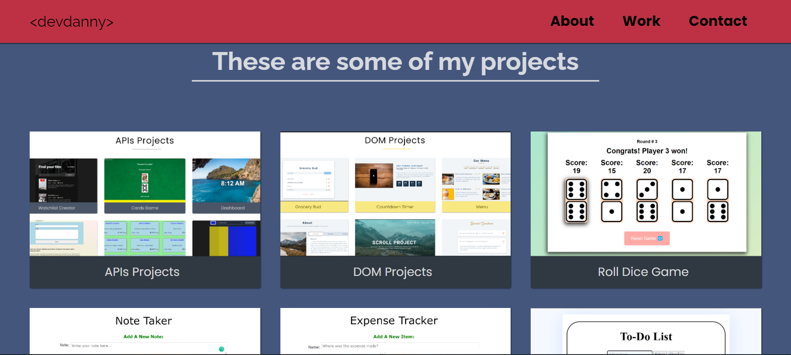

# Small Projects Portfolio

This repository keeps my projects that aren't meant to get into my main portfolio



## Welcome! 👋
## Table of contents

- [My process](#my-process)
  - [Projects list](#projects-list)
  - [What I learned](#what-i-learned)
      - [APIs Projects](#apis-projects)
      - [DOM Projects](#dom-projects)
      - [Roll Dice Game](#roll-dice-game)
      - [JS Projects (@andy)](#js-projects)
      - [Battleships Game](#battleships-game)
  - [Continued development](#continued-development)
  - [Useful resources](#useful-resources)
- [Author](#author)
- [Acknowledgments](#acknowledgments)

## My process

### Projects list

- APIs Projects
- DOM Projects
- Snake Game
- Pacman
- Roll Dice Game
- Space Tourism Website
- Note Taker
- Expense Tracker
- To-Do List
- BBQ school registration form
- Blackjack
- Minimalism blog
- Battleships Game
- React Context App
- Responsive UI design
- Memory Game
- React built SPAs
- Emoji Personality
- Leads Tracker Chrome Extension
- Seeds company landing page
- Cars company survey form


### What I learned

#### APIs Projects

1) GET first 5 blog posts from an API

```js
    fetch('https://apis.scrimba.com/jsonplaceholder/posts')
        .then(response => response.json())
        .then(data => console.log(data.slice(0, 5)))

```

2) POST new data through an API

```js
fetch("https://apis.scrimba.com/jsonplaceholder/todos", {
    method: "POST",
    body: JSON.stringify({
        title: "Buy Milk",
        completed: false
    }),
    headers: {
        "Content-Type": "application/json"
    }
})
    .then(res => res.json())
    .then(data => console.log(data))
```

3) Not triggering a click event when targeting a child element

```scss
   &__dropbtn--arrow,
   &__dropbtn--content {
      pointer-events: none;
   }
```

4) !! ".disabled" class for buttons

```css
.disabled {
    pointer-events: none;
    background-color: #cccccc;
    color: #666666;
    cursor: default;
    /* cursor: not-allowed; */
}
```

5) remove <a> default styling

```css
   a, a:hover, a:focus, a:active {
      text-decoration: none;
      color: inherit;
  }
```

6) full screen background image

```css
    html { 
        background: url(images/bg.jpg) no-repeat center center fixed; 
        -webkit-background-size: cover;
        -moz-background-size: cover;
        -o-background-size: cover;
        background-size: cover;
    }
```

7) making text more readable

```css
p {
    /* text-shadow: 1px 1px 2px #474747; */
    text-shadow: 0 0 20px #aaaaaa;
}
```

8) taking a small app to the center

```css
body {
    margin: 0;
    min-height: 100vh;
    display: flex;
    justify-content: center;
    align-items: center;
    /* background: red;
    border: 5px solid white; */
}
```

9) turn HTMLCollection into an array

```js
    let myPhotoImgs = Array.from(document.getElementsByClassName("my-photo"))
    myPhotoImgs.forEach(photoImg => 
```

10) asign each data piece a unique id while fetching

```js
async function getBooks() {
    let response = await fetch('books.json')
    let books = await response.json()
    let n = 1
    return books.map(book => {
        book.id = n
        n += 1
        return book
    })
}

getBooks().then(books => {
    console.log(books)
})
```

11) similar items display with grid

```css
.portfolio {
    padding: 1em;
    display: grid;
    grid-template-columns: repeat(auto-fit, minmax(200px, 1fr));
    grid-gap: 1em;
} 
```


#### DOM Projects

1) An ability to save a classList in a variable

```js
document.querySelectorAll('.btn').forEach(btn => {
   btn.addEventListener('click', (e) => {
      const classList = e.target.classList;
      console.log(classList);
   })
})
```

2) Load initial item

```js
window.addEventListener("DOMContentLoaded", function () {
   // yada yada
});
```

3) basic setup for mobile navbar

```css
.links {
  height: 0;
  overflow: hidden;
  transition: var(--transition);
}
.show-links {
  height: 10rem;
}
/* ! Important thing here is to use "height: auto" for bigger sreen */
@media screen and (min-width: 800px) {

  .links {
    height: auto;
    display: flex;
  }

}
```
```js
document.querySelector('.nav-toggle').addEventListener('click', () => {
   const links = document.querySelector('.links');
   links.classList.toggle('show-links');
})
```

4) the way to get the, for example, "data-id" property of a DOM element

```js
const category = e.currentTarget.dataset.id;
```

5) How I get the current year

```js
const date = document.querySelector('#date');
date.innerHTML = new Date().getFullYear();
```

6) how to render links dynamically on click event
!! make notice element.style.height must be a string type !!
!! and also there will be a need to specify the 'height: auto;' property of the links-container in a widescreen mode with the !important !!

```js
const linksContainer = document.querySelector('.links-container');
const links = document.querySelector('.links');

document.querySelector('.nav-toggle').addEventListener('click', () => {
   const linksContainerHeight = linksContainer.getBoundingClientRect().height;
   const linksHeight = links.getBoundingClientRect().height;

   console.log('hello')
   if (linksContainerHeight === 0) {
      linksContainer.style.height = `${linksHeight}px`;
   } else {
      linksContainer.style.height = 0;
   }
})
```

7) the way to scroll down and up to some position

```js
   window.scrollTo({
      left: 0,
      top: position
   })
```

8) the way to get the top position of an element

```js
   const sectionPosition = section.offsetTop;
```

#### Roll Dice Game

1) The piece of code I've written to render 2 separate dices in the certain nested elements.
```js
   displayResult: function(player) {
      const diceWrappers = document.getElementsByClassName('dice-wrapper');
      let diceList = diceWrappers[player].children;
      diceList[0].innerHTML = model.dices[0];
      diceList[1].innerHTML = model.dices[1];
   },
```

#### JS Projects

1) the way to make a copy of a DOM element with its children

```js
let someObj = {
      createNewRow: function() {
      const tBody = document.querySelector('#tBody');
      const expenseRow = document.querySelector('.output__tr');

      tBody.appendChild(expenseRow.cloneNode(true));
   }
}
```

2) learned to fit content in one or two even columns
```css
div {
   border: 1px solid #CDCDCD;
   min-width: 40%;
   flex: 1 1 0;
   margin-bottom: .5em;
   text-align: left;
   padding: .5em;
}
```

#### Battleships Game

1) the way to present ships in the game within OOP

```js
let model = {
  
  ships = [
    { locations: ["", "", ""], hits: ["", "", ""] },
    { locations: ["", "", ""], hits: ["", "", ""] },
    
  ],
  
};
```

2) .indexOf() method returns an index of its value in the brackets. Used to find index inside both arrays and strings
```js
// I check if the locations array has a sought element and if it does the method returns its index. 
// Otherwise it returns -1. The index variable keeps the result.
let index = ship.locations.indexOf(guess);
```

3) string.charAt(index) method returns a character of a string, located on the specified index
```js
// I use it to get letter out of the user's input and turn it into a number later on 
let firstChar = guess.charAt(0);
```

4) the isNaN() function determines whether a value is NaN (not a number) or not
```js
// I use it to check whether a user's guess follows the demands,
// i.e. if any value is not a number, the warning appears
if ( isNaN(row) || isNaN(column) ) {
   alert("Oops, that is not on the board");
}
```

5) making chosen functions load in advance
```js
window.onload = init;
```

6) using .click() method to add keyboard functionality to a button
```js
// used this method to invoke a function via keyboard event
// the function is initially listens to mouse clicks
function init() {
(...)
   const guessInput = document.querySelector('#guessInput');
   guessInput.onkeyup = handleKeyPress;
}

function handleKeyPress(e) {
   let fireButton = document.getElementById('fireButton');
   if(e.key === 'Enter') {
      fireButton.click();
      return false;
   }
}
```

#### The Welcome Page

1) make a hidden attribute work

```css
[hidden] {display: none !important;}
```

#### Blackjack game

1) the .flow class to add space on top of children

```html
<div class="flow" style="flex-basis: 100%; --flow-space: 4rem">
</div>
```
```css
.flow > *:not(:first-child) {
  margin-top: var(--flow-space, 1rem);
}
```

#### Emoji Personality
1) an easy method to fetch value from an input field

```js
document.getElementById('textbox_id').value;
// For example
document.getElementById("searchTxt").value;
```


### Continued development

* aria (Accessible Rich Internet Applications);
* CSS custom properties (figure out all the advantages of setting variables);
* the clamp() property;
* CSS grid;
* the minmax() property;
* the translateX(Y) property;


### Useful resources
#### APIs Projects
- [String.prototype.padStart()](https://developer.mozilla.org/ru/docs/Web/JavaScript/Reference/Global_Objects/String/padStart) - Was inroduced in the ES6 chapter.
- [ES6 classes](https://developer.mozilla.org/ru/docs/Web/JavaScript/Reference/Classes) - The MDN article about classes.
- [Find Object In Array](https://stackoverflow.com/a/35397839/16906724) - Heplped me deal with finding the eaten ghosts in array of ghosts by the value of its key in Pacman.
- [Form.reset()](https://developer.mozilla.org/ru/docs/Web/API/HTMLFormElement/reset) - method to set,e.g., inputEl.value to "".
- [Copy To Clipboard](https://stackoverflow.com/a/64422721/16906724) - helped me figure out how to copy content onclick for "Colors Generator".
- [Show Time](https://stackoverflow.com/a/30245911/16906724) - article on date and time fetching.

#### DOM Projects
- [pageYOffSet](https://stackoverflow.com/a/28144651/16906724) - The answer helped me track the scroll event.
- [month-days-number](https://stackoverflow.com/a/1184359/16906724) - how to find the number of days in a month.
- [countdown-timer](https://www.educative.io/edpresso/how-to-create-a-countdown-timer-using-javascript) - this contains the text format tutorial to build the timer.
- [prevent-refresh](https://stackoverflow.com/a/22772518/16906724) - how to prevent a page from refreshing after submitting a form.

#### Roll Dice Game
- [childNodes vs children](https://stackoverflow.com/questions/10381296/best-way-to-get-child-nodes) - the first answer in a "user-freindly" way explains the practical difference between childNodes and children properties.
- [Element.children](https://developer.mozilla.org/en-US/docs/Web/API/Element/children) - the article about Element.children property on MDN.

#### JS Projects (@andy)
- [Find li index](https://stackoverflow.com/questions/18295673/javascript-find-li-index-within-ul) - This helped me build the To-Do app.
- [Data from form to table](https://stackoverflow.com/questions/18295673/javascript-find-li-index-within-ul) - Has the answer how to do it with the plain JS.
- [remove item from HTML collection](https://stackoverflow.com/questions/37311003/how-to-remove-an-item-from-htmlcollection) - Helped with the expense-tracker.
- [Indexes Search By Clicking](https://stackoverflow.com/a/23528539/16906724) - finally this helped me figure out the way to fetch an index of an element or its relatives by clicking on it.


#### From early projects
- [Fetch input field content](https://stackoverflow.com/questions/11563638/how-do-i-get-the-value-of-text-input-field-using-javascript) - This article contains more info on methods to fetch value from an input feild.
- [Align vertically (r)](https://ruseller.com/lessons.php?id=1248) - The article gives 6 methods to vertically align with css.

#### Default
- [Grid Attack](https://codingfantasy.com) - This helped me practice CSS GRID. Challenging and interactive game aimed at learning the css grid properties' application.
- [Git + GitHub](https://www.youtube.com/watch?v=RGOj5yH7evk) - the basic git commands (Youtube).
- [The Markdown Guide](https://www.markdownguide.org/) - for more help with writing markdown (Article).

## Author

- Github - [DannyLenk](https://github.com/DannyLenk)
- Facebook - [Valerii Danylenko](https://www.facebook.com/valerii.danylenko)
- LinkedIn - [Valerii Danylenko](https://www.linkedin.com/in/valerii-danylenko-74379212b)
- insta - [valeriidanylenko](https://www.instagram.com/valeriidanylenko/?hl=ru)
- Frontend Mentor - [@DannyLenk](https://www.frontendmentor.io/profile/DannyLenk)

## Acknowledgments

Thank you, Scrimba and its community. Thank you FreeCodeCamp and its community. Thank you, Front-end mentor and its community.
