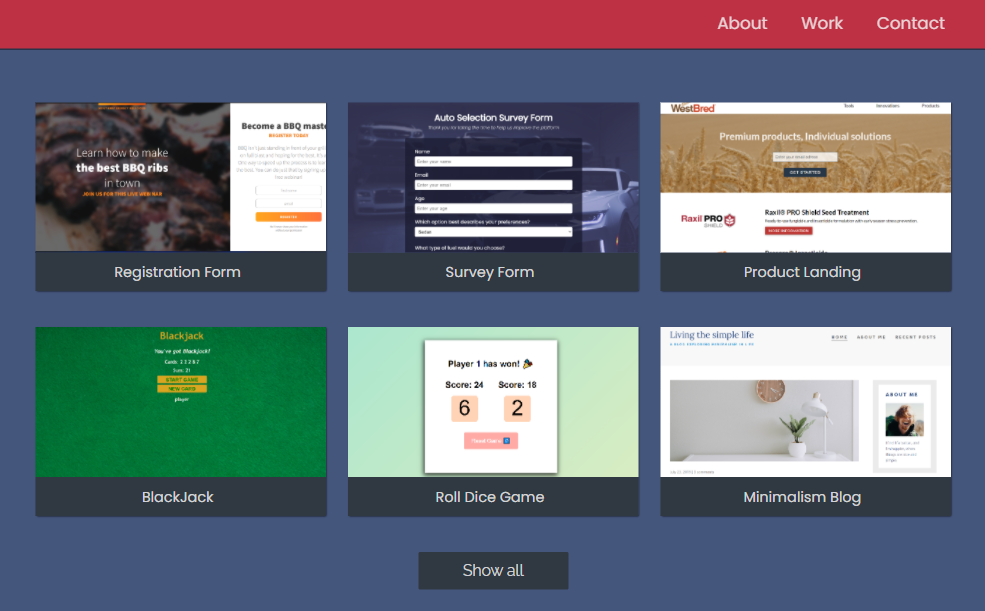

# Small Projects Portfolio

This repository keeps my projects that aren't meant to get into my main portfolio



## Welcome! 👋
## Table of contents

- [My process](#my-process)
  - [Projects list](#projects-list)
  - [What I learned](#what-i-learned)
  - [Continued development](#continued-development)
  - [Useful resources](#useful-resources)
- [Author](#author)
- [Acknowledgments](#acknowledgments)

## My process

### Projects list

- BBQ school registration form
- Cars company survey form
- Seeds company landing page
- Blackjack game
- Roll dice game
- Minimalism blog

### What I learned

#### Blackjack game

1) An easy way to toggle buttons passing arguments

```js
function toggleBtns(none, block) {
   none.style.display = "none";
   block.style.display = "block";
}
```

2) the .flow class to add space on top of children
```html
<div class="flow" style="flex-basis: 100%; --flow-space: 4rem">
</div>
```
```css
.flow > *:not(:first-child) {
  margin-top: var(--flow-space, 1rem);
}
```


### Continued development

* aria (Accessible Rich Internet Applications);
* CSS custom properties (figure out all the advantages of setting variables);
* vh, vw values and their relevance;
* the clamp() property;
* CSS grid;
* JS - setting local variables;
* the minmax() property;
* the translateX(Y) property;

*Use this section to outline areas that you want to continue focusing on in future projects. These could be concepts you're still not completely comfortable with or techniques you found useful that you want to refine and perfect.

### Useful resources

- [Grid Attack](https://codingfantasy.com) - This helped me practice CSS GRID. Challenging and interactive game aimed at learning the css grid properties' application.
- [Glassmorphism Generator](https://hype4.academy/tools/glassmorphism-generator) - This may be handy if you need to apply the glassmorphism effect. Except the generator, they have articles on this topic.
- [Attribute Selection](https://stackoverflow.com/questions/64312576/how-to-select-an-element-with-attribute-role) - the first answer in article contains the syntax of DOM attribute selection as well as the link to the detailed article on MDN Web Docs.

- [Git + GitHub](https://www.youtube.com/watch?v=RGOj5yH7evk) - the basic git commands (Youtube).
- [The Markdown Guide](https://www.markdownguide.org/) - for more help with writing markdown (Article).

## Author

- Github - [DannyLenk](https://github.com/DannyLenk)
- Frontend Mentor - [@DannyLenk](https://www.frontendmentor.io/profile/DannyLenk)
- Facebook - [Valerii Danylenko](https://www.facebook.com/valerii.danylenko)
- LinkedIn - [Valerii Danylenko](https://www.linkedin.com/in/valerii-danylenko-74379212b)
- insta - [valeriidanylenko](https://www.instagram.com/valeriidanylenko/?hl=ru)

## Acknowledgments

Thank you, Scrimba and its community. Thank you, Front end mentor and its community
